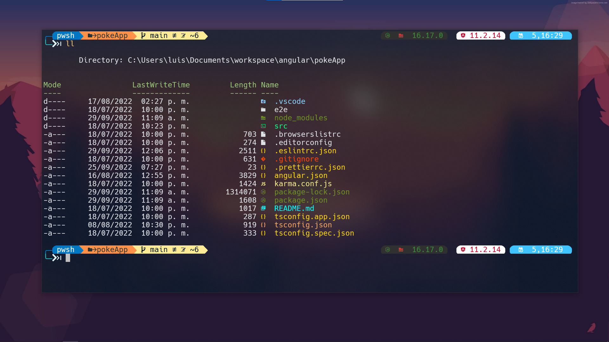
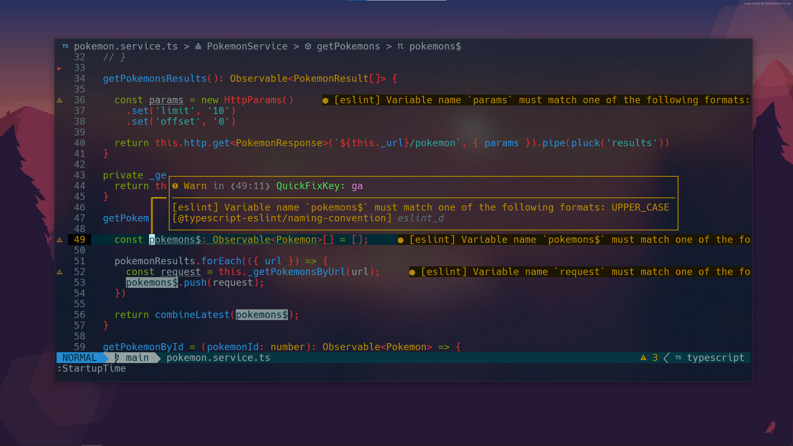
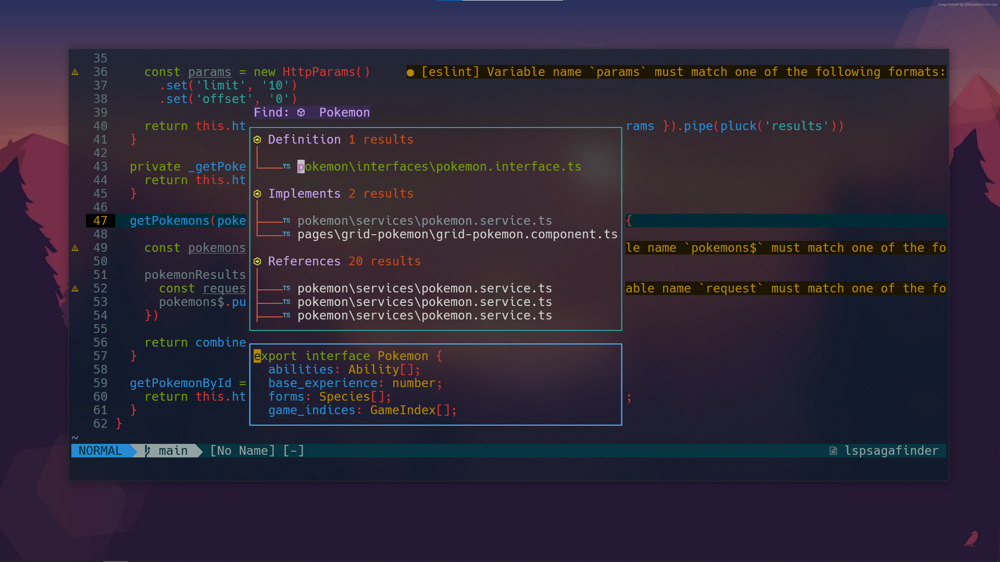
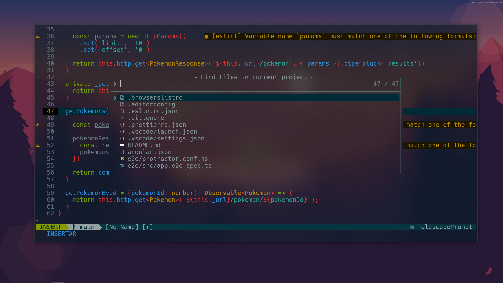
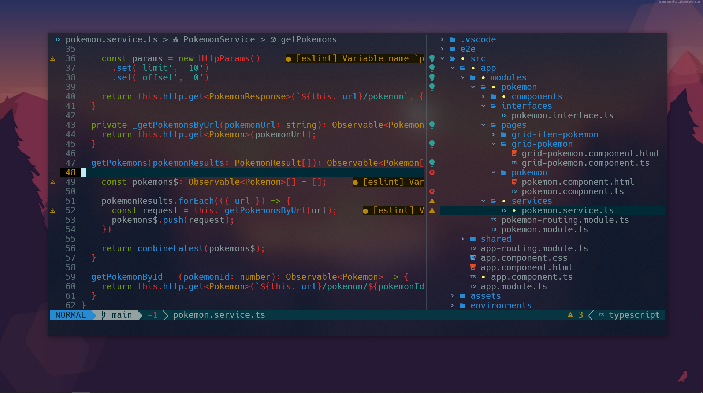
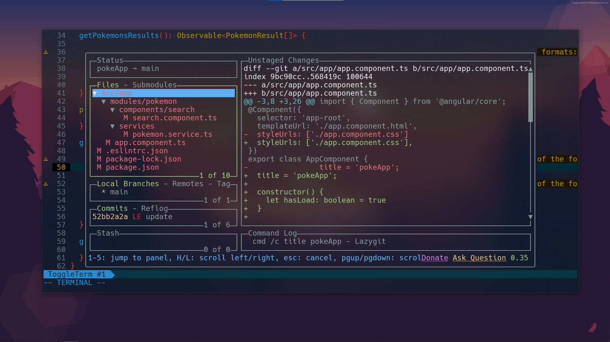
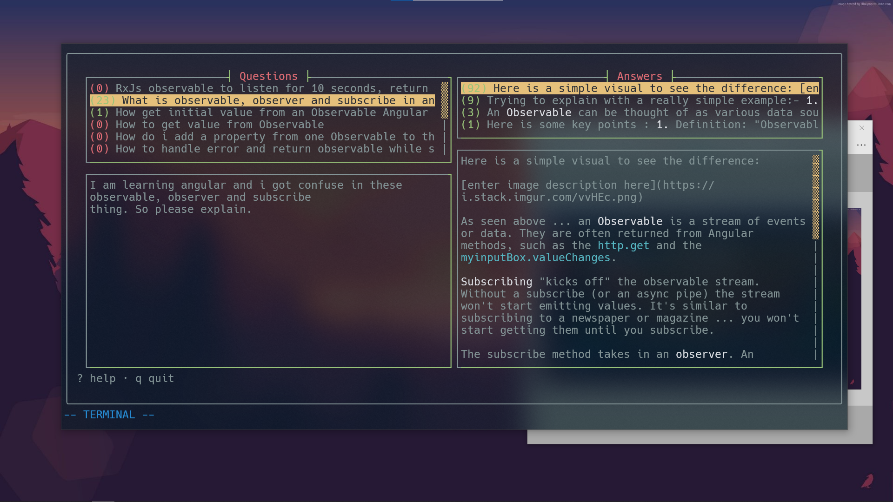
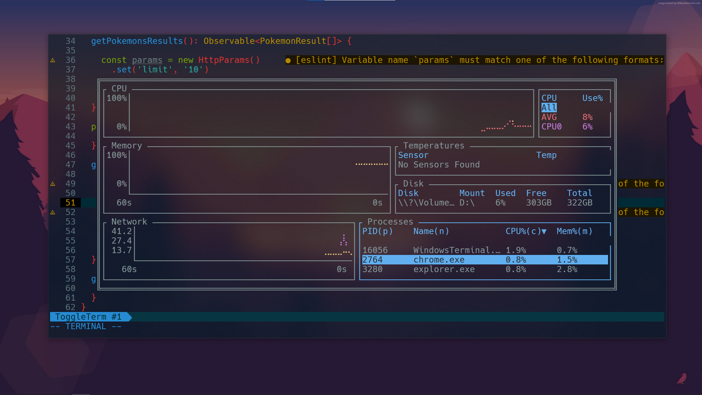
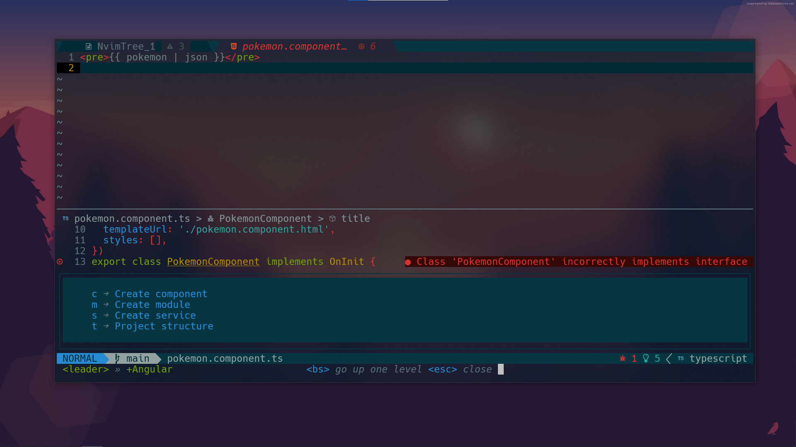

<!--  -->




# Luis's dotfiles

Requires Neovim (>= 8.0)

## Contents

- [Terminal](#terminal)
  * [Install terminal](#install-windows-terminal)
  * [Installl nerd font](#nerd-font)
  * [Settings](#settings)
- [Package Manager](#package-manager)
  * [Scoop](#install-scoop)
  * [Scoop Dependencies](#scoop-dependencies)
- [Powershell](#powershell)
  * [Modules](#modules)
  * [Profile](#profile)
- [NPM](#npm)
  * [NPM Dependencies](#npm-dependencies)
- [Neovim](#neovim)
- [Lazygit](#lazygit)
- [All dependencies](#all-dependencies)


## Terminal

### Install Windows Terminal

[Windows Terminal Preview](https://apps.microsoft.com/store/detail/windows-terminal-preview/9N8G5RFZ9XK3?hl=es-es&gl=es)

### Nerd Font

Download and install **[Hack NerdFont](https://github.com/ryanoasis/nerd-fonts/releases/tag/v2.2.1)**

### Settings

Copy and page in your **[settings.json](https://gist.github.com/luis-jauregui/2ca4a8c9656fe37c124dbe4424b66d09)**

## Package manager

### Install Scoop

````
irm get.scoop.sh | iex
````

### Scoop Dependencies

````
scoop install gcc fd jq tree-sitter neovim ripgrep sudo python lessmsi fzf oh-my-posh dark git nodejs-lts winfetch
````

````
pip3 install pynvim
````

````
scoop bucket add extras
scoop install so lazygit bottom
````

## Powershell

### Modules

````
Install-Module -Name Terminal-Icons
Install-Module -Name z
Install-Module -Name PSReadLine
````

### Profile

Create profile

1. Open profile in your terminal

````
notepad $PROFILE
````

2. Paste path

````
. $env:USERPROFILE\AppData\Local\nvim\.powershell\user_profile.ps1
````

## NPM

### NPM Dependencies

````
npm install -g typescript live-server yarn commitizen@latest cz-conventional-changelog@latest @commitlint/config-conventional@latest @commitlint/cli@lastest
````

## Neovim

Clone in this path `C:\Users\YOUR_PORFILE\AppData\Local`

````
git clone https://github.com/luis-jauregui/dotfiles.git
````

## Lazygit

Add config in this file `C:\Users\YOUR_PORFILE\AppData\Roaming\lazygit\config.yml`

````
customCommands:
  - key: "Z"
    command: "git cz"
    context: "files"
    loadingText: "opening commitizen commit tool"
    subprocess: true
````

## All dependencies

| scoop dependencies |
|--------------------|
| gcc                |
| fd                 |
| jq                 |
| tree-sitter        |
| neovim             |
| ripgrep            |
| sudo               |
| python             |
| lessmsi            |
| fzf                |
| oh-my-posh         |
| dark               |
| git                |
| nodejs-lts         |
| winfetch           |
| so                 |


| modules        | description          |
|----------------|----------------------|
| Terminal-Icons | just icons           |
| Z              | quickly navigate     |
| PSReadLine     | command line editing |
